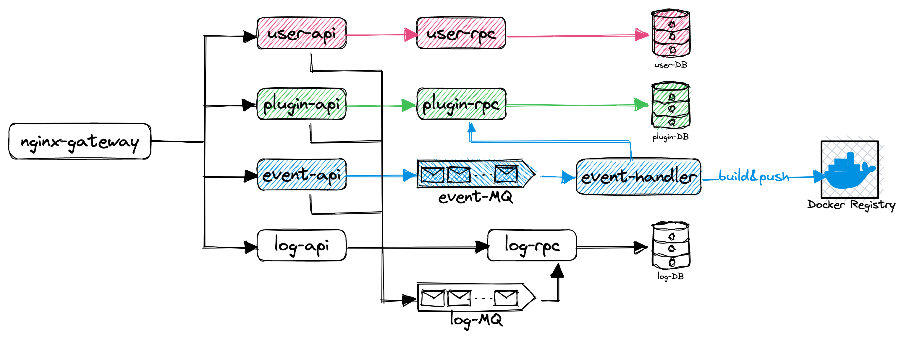

- 项目名称：[为 Envoy Go 扩展建设插件市场](https://summer-ospp.ac.cn/org/prodetail/23f080259?lang=zh&list=pro)
- 申请人：徐皓
- 联系邮箱：nx@nickxu.me

---

[TOC]

---

# 项目背景

## 项目描述

Envoy是当前最流行的网络代理之一，Go扩展是MOSN社区为Envoy增加的Go生态基础，也是MoE框架的基础。

受益于Golang生态系统，研发可以轻松在Envoy实现插件用于更多的长尾场景，其中很多场景都是通用的。

本项目是为Envoy GO扩展构建插件市场。在插件市场中，人们可以在插件市场中贡献他们已经建设好并已经在生产环境中使用的优质插件，并由其他人来使用。通过插件市场，可以让Envoy生态变得更加开放、共享、丰富

## 产出要求

1. 提供一个Envoy GO插件的内容平台，在这里可以发布经过社区review的优秀插件，需要拥有服务端与前端页面
2. 不自建账号体系，通过GitHub OAuth2.0完成用户认证与授权
3. 对接GitHub OpenAPI，支持动态获取插件所在仓库信息，包括README，分支版本以及star数

---

# 实现方案

## 全局设计

项目整体由三个部分组成：GitHub，插件市场本体，和 Docker Registry

### GitHub

本插件市场可以使用 GitHub 作为基础设施来实现部分功能，不必重复造轮子

- 作为代码仓库

  在 GitHub 中建立一个 Organization，将插件仓库移交到这个组织中，即为在市场中上架了插件，也就是说组织中的仓库与插件市场中的插件一一对应
- 用户认证与授权

  在组织中新建一个 Admin Team，团队中的成员即为管理员，使用 GitHub OAuth 登录便可在后端拿到用户身份
- 作为讨论与审核平台

  可以直接在 GitHub 上发起对插件的 Issue 与 PR ， 所有人也都可以对 PR 给出自己的建议

  为避免上传恶意代码与漏洞，只有管理员才能合并 PR 与发布 Release

### 插件市场本体

市场本体的功能可以用户相关与插件相关

- 用户相关

  基于GitHub OAuth 2.0的用户认证与授权

  管理组织和团队中的成员
- 插件相关

  列出和搜索插件

  申请与处理发布请求

  管理已发布的插件

  为每个发布版本构建并推送 Docker 镜像

### Docker Registry

本部分用于保存与分发每个插件版本的 Dokcer 镜像，供用户拉取使用

应当设置为仅后端服务与能推送与删除镜像，而普通用户只读

## 后端架构

- `promtail` 收集并打包运行日志
- `loki` 接收日志并存储
- `jaeger` 链路追踪
- `prometheus` 服务监控
- `grafana` 查看日志收集、链路追踪、服务监控的数据

## 微服务拆分

将服务分为 4 块，分别是 `user`、`plugin`、`event` 与 `log`

### user

user 部分负责从 GitHub OAuth 登录，虽说不自建账号体系，但我感觉还是有些东西需要存储，比如 GitHub OAuth 拿到的 token （这个的有效期应该是 30 天）

并且考虑到可扩展性，我想还是设计一个 rpc 服务

### plugin

负责插件存储的增删改查，维护 GitHub 仓库与插件市场的一致性关系

### event

监听从 GitHub 传来的事件，调用 `plugin-rpc` 更新信息，同时对 relase 编译并推送镜像

### log

收集后端产生的操作记录，供管理员查看

## 特殊场景处理

### 后端宕机

GitHub 会向后端推送事件，如果后端发生宕机，这些事件便不能被处理

针对这一场景，主要需要下面两种方法解决

1. 基于 GitHubActions/Webhool 的重试机制
2. 准备一个消息队列用于存储事件，`event-api` 用于监听事件，并放入消息队列中

   同时将其他部分独立部署，并尽量保证 `event-api` 的高可用

## 可能存在的问题与改进项

### GitHub API 限流

但我看了一下好像 OAuth 登录后请求能有每小时 5,000 个，[应该没问题](https://docs.github.com/zh/rest/overview/resources-in-the-rest-api?apiVersion=2022-11-28#rate-limits-for-requests-from-personal-accounts)

### 申请上架的流程

这是目前的上架流程，可能还可以改进

首先在组织里有一个 bot ，它专门将个人仓库拉进组织里

1. 用户同意上架插件，并同时将 bot 设为仓库的 admin
2. 管理员同意上架审核后，这个 bot 将仓库移交给组织，并初始化（添加一些 GitHub Actions 与 Webhook）

---

# 开发规划

目前的大致开发规划：

- 第一个月（或者从现在开始）完成后端开发，调试好与 GitHub 的调用流程
- 第二个月编写前端，同时发现并处理可能的 bug
